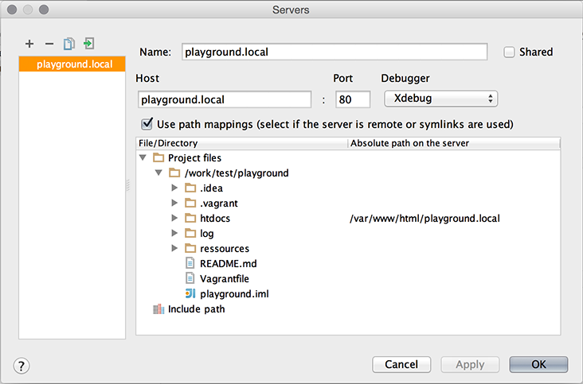
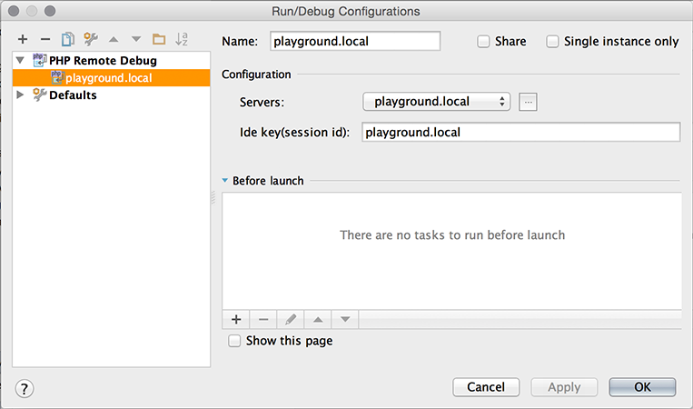

# PlayGround

This is my Vargrant-powered Ubuntu-based LAMP **PlayGround**.

It's equipped with
- Apache
- HTTPS
- PHP
- xDebug
- MySQL
- phpMyAdmin

## Requirements

Please make sure that the following software is present.

### VirtualBox incl. VM Extension Pack (Version: 5.0.10)

VirtualBox is a virtualization software that is used by Vagrant to supply environments. You also need the respective *Oracle VM Extension Pack*.

[https://www.virtualbox.org/wiki/Downloads](https://www.virtualbox.org/wiki/Downloads)

### Vagrant (Version: 1.7.4)

Vagrant is a software for managing virtual environments. It is used to setup, start and stop environments as needed. Vagrant also takes care of the environment provisioning. The software is available for download on the following url:

[http://www.vagrantup.com/](http://www.vagrantup.com/downloads.html)

### Vagrant Host Manager

Vagrant Host Manager (`vagrant-hostmanager`) is a Vagrant 1.1+ plugin that manages the `/etc/hosts`
file on guest machines (and optionally the host). Its goal is to enable
resolution of multi-machine environments deployed with a cloud provider
where IP addresses are not known in advance.

Install the plugin following the typical Vagrant 1.1 procedure:

    $ vagrant plugin install vagrant-hostmanager

Add following lines in the sudoers file (`sudo visudo`) for passwordless operation:

    Cmnd_Alias VAGRANT_HOSTMANAGER_UPDATE = /bin/cp /home/user/.vagrant.d/tmp/hosts.local /etc/hosts
    %sudo ALL=(root) NOPASSWD: VAGRANT_HOSTMANAGER_UPDATE

## Operation

### Confuguration

The config file is here: `ressources/provisioning/config.yaml`

Value          | Default value      | Description
-------------- | ------------------ | -----------
cpus           | 1                  | Number of CPUs
memory         | 1024               | Amount of memory, MB
vm_hostname    | 'playground'       | The name of the machine
private_ip     | '192.168.22.22'    | IP address of the machine
server_name    | 'playground.local' | The name of the webserver
mysql_password | 'root'             | Password for root
host_webroot   | './htdocs/'        | Location of the document root in the local file system.
hostmanager_aliases | 'www.playground.local', 'data.playground.local' | List of hostnames written to `/etc/hosts` additional to `${server_name}`.

Add your files to `${host_webroot}`.

### Startup

    $ vagrant up

and wait some minutes and point your browser to

    http://#{server_name}/

### SequelPro

Connect to the database over SSH:

    MySQL-Host = "127.0.0.1"
    MySQL-User = "root"
    MySQL-Password = ${mysql_password}
    SSH-Host = ${server_name}
    SSH-User = "vagrant"
    SSH-Password = "vagrant"

### phpMyAdmin

phphMyAdmin is available here:

    http://#{server_name}/phpmyadmin

Login with `root` and the `${mysql_password}`

### JetBrains IntelliJ IDEA 14

Useful plugins:

- PHP
- Vagrant

Configure a server and map sourcefiles to path on the server:

Use server for debug configuration:

Adjust settings to `${server_name}` if you change the default `playground.local`

Start debugging:

- Set breakpoint
- Start debug session
- Open page in browser
